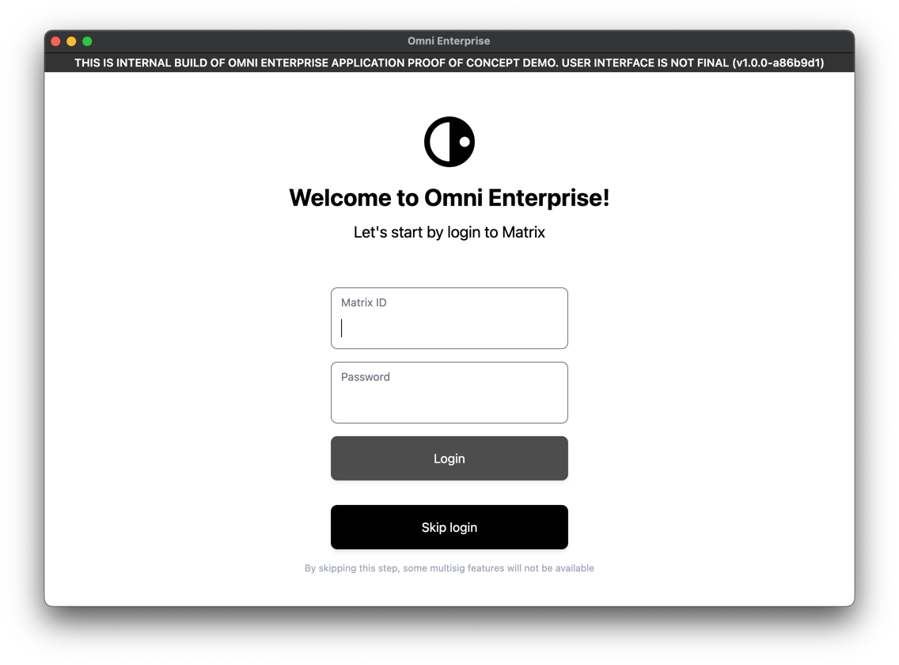
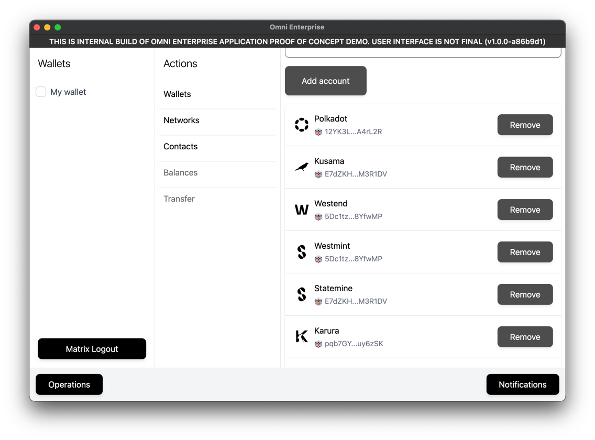
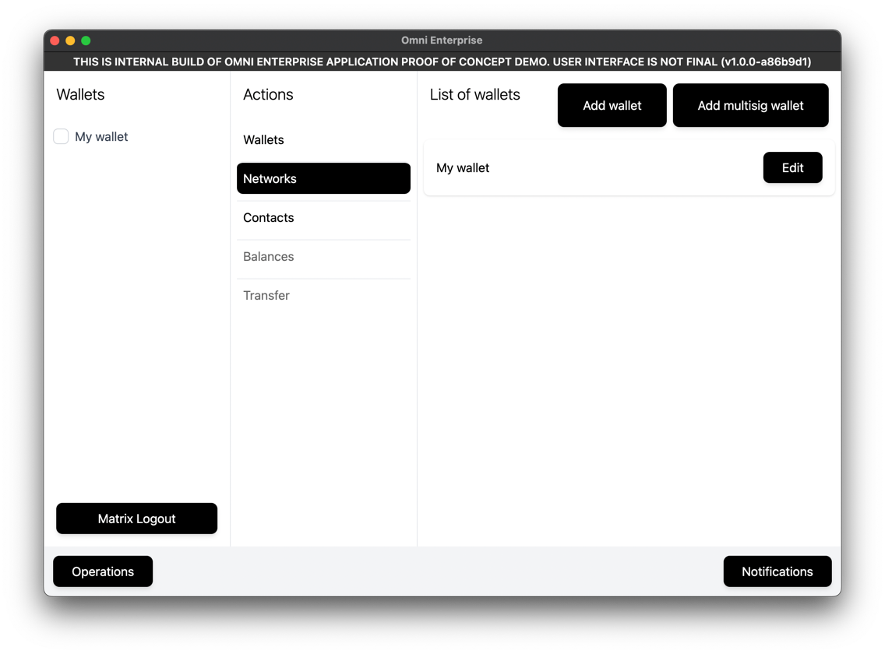
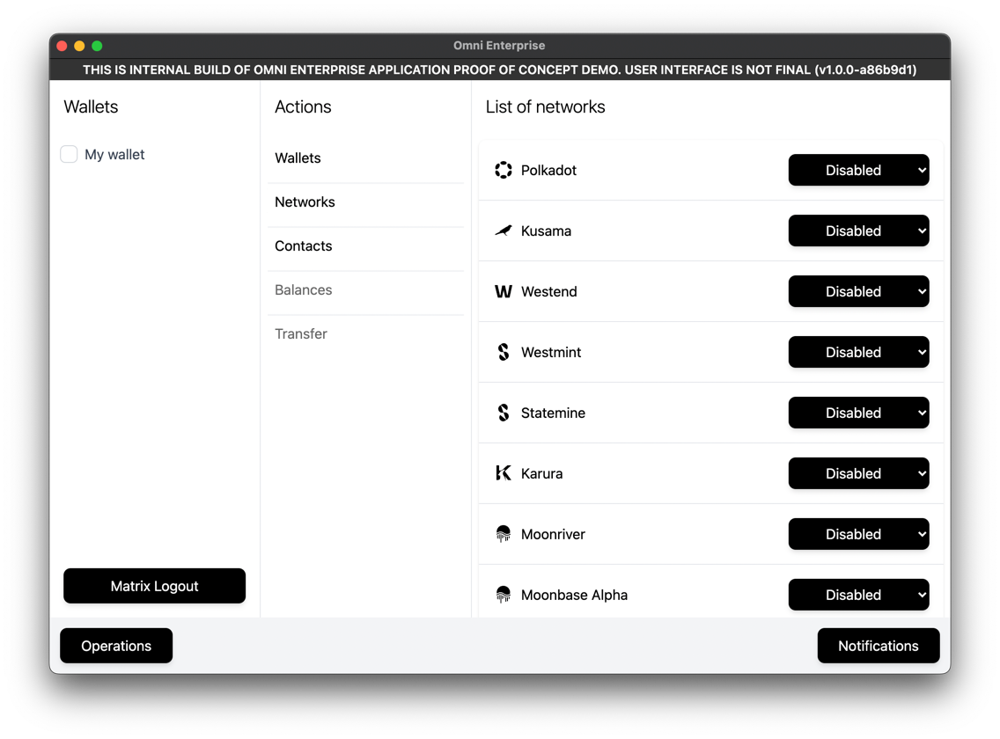
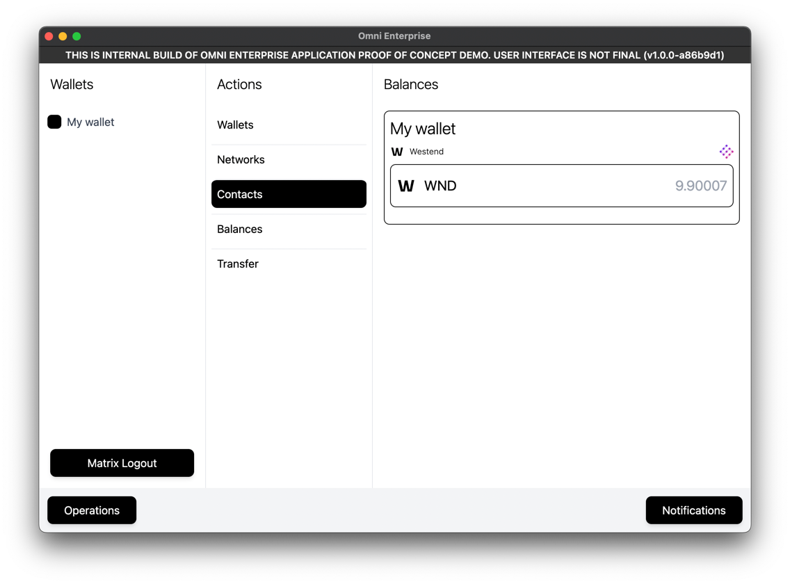
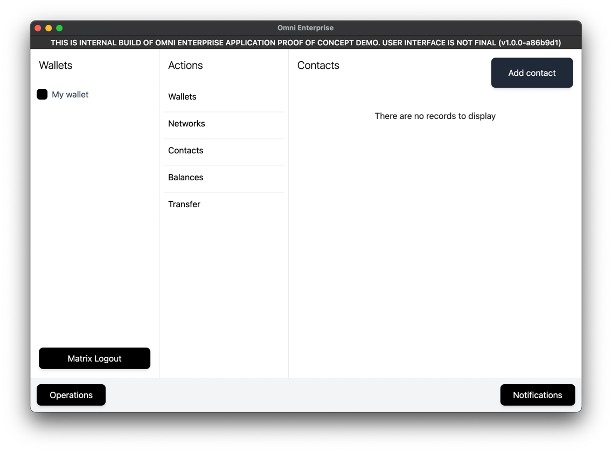
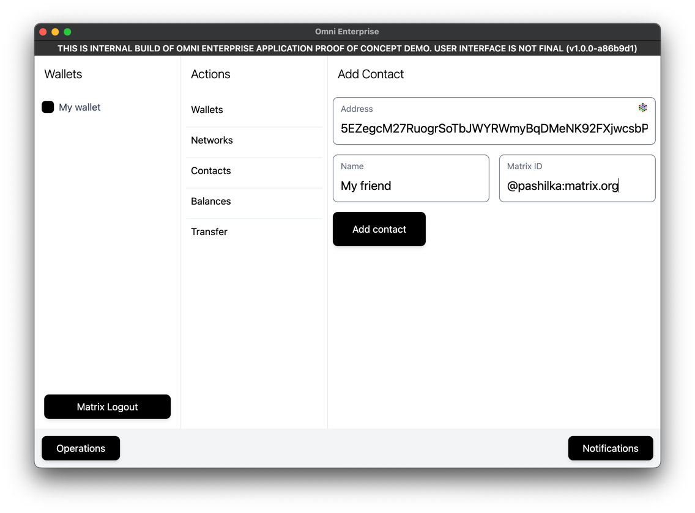

# Disclaimer

This application is a proof of concept and not production-ready.

USE AT OWN RISK.

# Omni Desktop

Polkadot&Kusama ecosystem Enterprise Desktop application.

The Omni Desktop application proof of concept application was developed in order to:
1. Check if it's possible to work with multiple Substrate networks in one desktop application.
2. Check if it's possible to verify the parachain data based on relay-chain data.
3. Try to use [Substrate Connect](https://github.com/paritytech/substrate-connect) as a light client.
4. Try to use [Parity Signer](https://github.com/paritytech/parity-signer) mobile application for signing transactions.
5. Try to use [Matrix](https://matrix.org/) standard as an application-layer data exchange protocol.

## Key features

1. Add and manage wallets for Substrate networks.
2. Show wallet balances for multiple Substrate networks.
3. Token transfers in multiple Substrate networks.
4. Multisig account management.
5. Multisig creation and signing.
6. Multisig account and transactions interaction with Matrix standard.

# How to use the application
## Install the application
There are two options for the application installation:
1. Download the [latest application release](https://github.com/nova-wallet/omni-desktop-prototype/releases/tag/v1.0.0) for your operating system. And proceed with installation.
2. Clone the repository and start the application from sources:
```bash
git clone https://github.com/nova-wallet/omni-desktop-prototype.git
git checkout v1.0.0
yarn
yarn start
```

## Onboarding
The Matrix login and password should be used for the Multisig accounts and transactions automatic data exchange among the signatories.

This step may be skipped. In that case the Multisig transaction call data and Multisig account information should be shared manually across the signatories.


## Add wallet
Click to the `Add Wallet` button.


Enter the wallet name.


And click `Edit` button.


Enter the wallet address in the Substrate format with any SS58 prefix. Click `Add account` button.


The Omni application will derive the address for all supported networks.


## Connect to networks
The Network should be connected in order to check the balance and make a transfer.





## Check the balance


## Address book







# Development

## Requirements

Minimum version of `Node.js` is `v14`.

Tested with `v14` and `v16` LTS releases.

## Install dependencies

To install all dependencies:

```bash
yarn
```

## Starting development

Start the app in the `dev` environment with hot-reload:

```bash
yarn start
```

## Packaging for production

To package app for the local platform:

```bash
yarn package
```
